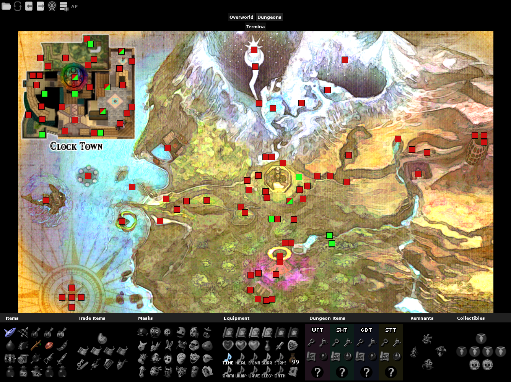

Archipelago Majora’s Mask Recompiled tracker pack for [PopTracker](https://github.com/black-sliver/PopTracker/) with auto-tracking, made by Seto and G4M3R L1F3.

PopTracker v0.27.0 or higher is recommended.

## Installation

[Download the latest build or source](https://github.com/G4M3RL1F3/Majoras-Mask-AP-PopTracker-Pack/releases/latest) and move the file into your packs folder. Alternatively, you can drag it on top of a PopTracker window, which will prompt you if you want to install the pack.

## More Info

This pack is a work in progress and is developed as the different logic difficulties are being worked on. It follows Archipelago’s logic, not necessarily matching standalone or higher difficulties at this time. If you encounter any bugs or have any questions, feel free to ask by pinging in Discord the pack maker (@seto10987) or the maintainer (@g4m3rl1f3).